# CrisisBridge

CrisisBridge is a hospitality-focused emergency coordination platform for rapid guest-to-staff incident response. It includes a guest emergency trigger UI, a responder dashboard, and a dedicated admin console with live incident visibility, room QR/NFC provisioning, escalation workflows, and tamper-evident incident logging.

> **Important:** This repository is an active prototype. Validate your own operational, legal, compliance, and safety requirements before production use in real emergency environments.

## Key Features

- Guest emergency trigger flow (Fire, Security, Medical) with contextual room/property metadata
- Real-time incident feed for responders and hospitality admins (Firebase RTDB)
- Dedicated admin route (`/admin`) with left navigation and live-priority incident panel
- B2B room provisioning APIs (signed room links, QR artifacts, CSV export, NFC payload support)
- Escalation pipeline for unacknowledged alerts
- Tamper-evident append-only audit ledger with integrity verification endpoint
- PWA service worker with background sync retry for triage requests

## Table of Contents

- [Tech Stack](#tech-stack)
- [Repository Structure](#repository-structure)
- [Prerequisites](#prerequisites)
- [Getting Started](#getting-started)
- [Environment Variables](#environment-variables)
- [Run the App Locally](#run-the-app-locally)
- [Routes and Views](#routes-and-views)
- [Architecture and Data Flow](#architecture-and-data-flow)
- [Diagrams](#diagrams)
- [API Reference](#api-reference)
- [Available Scripts](#available-scripts)
- [Troubleshooting](#troubleshooting)
- [Publish to GitHub](#publish-to-github)
- [Team Notes](#team-notes)

## Tech Stack

| Layer | Technology |
| --- | --- |
| Monorepo | pnpm workspaces |
| Frontend | React 19, Vite 8, Tailwind CSS |
| Backend | Fastify 5, Zod |
| AI | Google Gemini (`@google/genai`) |
| Real-time data | Firebase Realtime Database |
| Incident records | Firebase + tamper-evident server ledger |
| Escalation | SendGrid |
| Offline retry | Workbox Background Sync (`vite-plugin-pwa`) |

## Repository Structure

```text
CrisisBridge/
├─ apps/
│  ├─ web/                      # React guest/admin/responder UI
│  │  ├─ src/
│  │  │  ├─ components/
│  │  │  │  ├─ AdminConsole.jsx
│  │  │  │  ├─ ResponderDashboard.jsx
│  │  │  │  ├─ ProvisioningDashboard.jsx
│  │  │  │  └─ FlareTrigger.jsx
│  │  │  ├─ lib/firebase.js
│  │  │  ├─ sw.js
│  │  │  └─ assets/            # Architecture + process diagrams
│  │  ├─ .env.example
│  │  └─ vite.config.js
│  └─ server/                   # Fastify API and incident services
│     ├─ services/
│     │  ├─ triage.js
│     │  ├─ escalation.js
│     │  ├─ propertyProvisioning.js
│     │  └─ auditLedger.js
│     ├─ data/                  # Runtime audit ledger file (ignored)
│     ├─ .env.example
│     └─ index.js
├─ packages/
│  └─ types/                    # Shared Zod schemas
├─ CrisisBridge_Workflow.md
└─ package.json
```

## Prerequisites

- **Node.js** 20+
- **pnpm** 10+ (repo uses `pnpm@10.15.1`)
- A **Firebase project** with:
  - Realtime Database enabled
  - Firestore enabled
- Optional for full capability:
  - Google Gemini API key (AI triage + summary quality)
  - SendGrid API key (email escalations)

## Getting Started

### 1. Clone the repository

```bash
git clone <your-repo-url>
cd CrisisBridge
```

### 2. Install dependencies

```bash
pnpm install
```

### 3. Create local environment files

PowerShell:

```powershell
Copy-Item apps\web\.env.example apps\web\.env
Copy-Item apps\server\.env.example apps\server\.env
```

Bash:

```bash
cp apps/web/.env.example apps/web/.env
cp apps/server/.env.example apps/server/.env
```

### 4. Fill environment values

Use the tables in [Environment Variables](#environment-variables).

### 5. Start development

```bash
pnpm dev
```

This starts both:
- web: `http://localhost:5173`
- server: `http://localhost:3001`

## Environment Variables

### `apps/web/.env`

| Variable | Required | Description | Example |
| --- | --- | --- | --- |
| `VITE_BACKEND_URL` | No | Backend base URL for frontend. Keep `/api` locally to use Vite proxy. | `/api` |
| `VITE_FIREBASE_API_KEY` | Yes | Firebase Web API key | `AIza...` |
| `VITE_FIREBASE_AUTH_DOMAIN` | Yes | Firebase auth domain | `your-project.firebaseapp.com` |
| `VITE_FIREBASE_DATABASE_URL` | Yes | Realtime Database URL | `https://your-project-default-rtdb.firebaseio.com` |
| `VITE_FIREBASE_PROJECT_ID` | Yes | Firebase project ID | `your-project` |
| `VITE_FIREBASE_STORAGE_BUCKET` | Yes | Firebase storage bucket | `your-project.appspot.com` |
| `VITE_FIREBASE_MESSAGING_SENDER_ID` | Yes | Firebase sender ID | `1234567890` |
| `VITE_FIREBASE_APP_ID` | Yes | Firebase app ID | `1:1234567890:web:abcd1234` |

### `apps/server/.env`

| Variable | Required | Description | Example |
| --- | --- | --- | --- |
| `GEMINI_API_KEY` | Recommended | AI triage and summary generation; fallback logic is used if missing | `AIza...` |
| `SENDGRID_API_KEY` | Optional | Escalation email delivery key | `SG.xxxxx` |
| `ESCALATION_EMAIL_TO` | Required if SendGrid enabled | Escalation recipient email | `security.lead@hotel.example` |
| `ESCALATION_EMAIL_FROM` | Required if SendGrid enabled | Verified sender email/domain in SendGrid | `crisisbridge@hotel.example` |
| `GUEST_APP_BASE_URL` | Recommended | Base URL used for generated room QR/NFC links | `http://localhost:5173` |
| `ROOM_LINK_SIGNING_SECRET` | **Yes for production** | Signing secret for room-link signatures | `long-random-secret` |

## Run the App Locally

### Recommended (all services)

```bash
pnpm dev
```

### Run services separately

```bash
pnpm dev:web
pnpm dev:server
```

### Quick local verification

1. Open guest UI: `http://localhost:5173/?property=HOTEL-101&room=305`
2. Open admin UI: `http://localhost:5173/admin`
3. Trigger a guest alert and verify it appears live in admin.
4. Acknowledge and resolve from admin or responder.
5. Check backend health: `http://localhost:3001/health`
6. Verify audit trail (replace alert ID):
   ```bash
   curl http://localhost:3001/audit/<alertId>
   ```

## Routes and Views

| Route | Purpose |
| --- | --- |
| `/` | Guest emergency trigger view |
| `/?property=HOTEL-101&room=305` | Guest view scoped to property + room |
| `/?entry=nfc&property=HOTEL-101&room=305` | Guest view opened via NFC context |
| `/admin` | Hospitality admin console (default: live incidents) |
| `/admin/overview` | KPI overview |
| `/admin/provisioning` | QR/CSV room provisioning |
| `/admin/nfc` | NFC sticker/tag workflow |
| `/responder` | Responder operations dashboard |

## Architecture and Data Flow

### Runtime flow

1. Guest triggers emergency in web app.
2. Frontend calls `POST /triage` on Fastify backend.
3. Backend classifies via Gemini (or fallback), starts escalation timer, appends audit event.
4. Frontend writes alert into Firebase RTDB (`alerts/*`).
5. Admin and responder dashboards subscribe to RTDB and update in real time.
6. On acknowledge/resolve, dashboards update RTDB status and call backend lifecycle endpoints.
7. Backend writes hash-chained audit events and can verify chain integrity via `/audit/:alertId`.

### B2B room provisioning flow

1. Admin requests room artifacts for a property.
2. Backend generates signed guest URLs per room for QR/NFC entry.
3. Admin downloads CSV manifest and can write NFC tags through browser Web NFC (when supported).

### Offline and retry behavior

- Service worker uses Workbox `BackgroundSyncPlugin` for queued `POST /triage` retries.
- In development, service worker behavior can differ from production; validate offline replay in `build + preview` mode.

### Audit ledger behavior

- Ledger file: `apps/server/data/incident-audit-ledger.jsonl`
- Format: append-only JSON lines, each event hash-linked to previous event per alert.
- Verification endpoint recomputes hashes and reports integrity result.

## Diagrams

### Architecture



### Guest Alert Process Flow



### Staff Resolution Process Flow



## API Reference

Base URL (local): `http://localhost:3001`  
Frontend local proxy path: `/api` → `http://localhost:3001`

| Method | Endpoint | Purpose |
| --- | --- | --- |
| `GET` | `/health` | Health check and ledger file path |
| `POST` | `/triage` | Create triage result + escalation timer + audit trigger event |
| `POST` | `/acknowledge` | Mark alert acknowledged and cancel escalation timer |
| `POST` | `/resolve` | Finalize incident, generate AI summary, append resolution audit |
| `GET` | `/audit/:alertId` | Retrieve incident events + integrity verification |
| `POST` | `/b2b/properties/:propertyId/provision` | Generate signed room links + QR data URLs + NFC payload |
| `POST` | `/b2b/properties/:propertyId/provision/csv` | Export room provisioning manifest CSV |

### Example: Provision room artifacts

```bash
curl -X POST "http://localhost:3001/b2b/properties/HOTEL-101/provision" \
  -H "Content-Type: application/json" \
  -d "{\"floorStart\":1,\"floorEnd\":2,\"roomsPerFloor\":5}"
```

## Available Scripts

### Root

| Command | Description |
| --- | --- |
| `pnpm dev` | Run web and server in parallel |
| `pnpm dev:web` | Run web app only |
| `pnpm dev:server` | Run server only |
| `pnpm build` | Build workspaces (web build) |
| `pnpm lint` | Run workspace lint tasks |

### Web (`apps/web`)

| Command | Description |
| --- | --- |
| `pnpm --filter web dev` | Start Vite dev server |
| `pnpm --filter web build` | Production build |
| `pnpm --filter web preview` | Preview production build |
| `pnpm --filter web lint` | ESLint for web app |

### Server (`apps/server`)

| Command | Description |
| --- | --- |
| `pnpm --filter server dev` | Start Fastify API in watch mode |
| `pnpm --filter server start` | Start Fastify API |

## Troubleshooting

| Symptom | Likely Cause | Fix |
| --- | --- | --- |
| `NetworkError when attempting to fetch resource` from frontend | Backend not running or wrong backend URL | Start server (`pnpm --filter server dev`) and keep `VITE_BACKEND_URL=/api` locally |
| Alerts not appearing in admin/responder | Firebase config/rules issue | Verify `apps/web/.env` values and Realtime DB rules/connectivity |
| Provisioning endpoints fail | Invalid `propertyId` or payload shape | Use alphanumeric/dash property IDs and validate request body against endpoint schema |
| Escalation emails not sent | SendGrid variables missing | Set `SENDGRID_API_KEY`, `ESCALATION_EMAIL_TO`, `ESCALATION_EMAIL_FROM` |
| Offline replay not visible in local dev | Service worker behavior in dev mode | Validate with `pnpm --filter web build && pnpm --filter web preview` |

## Publish to GitHub

If this is the first push of this local repository:

```bash
git init
git add .
git commit -m "Initial CrisisBridge setup"
git branch -M main
git remote add origin https://github.com/<org-or-user>/<repo>.git
git push -u origin main
```

If the repo is already initialized, add/update remote then push:

```bash
git remote -v
git remote set-url origin https://github.com/<org-or-user>/<repo>.git
git push -u origin main
```

## Team Notes

- Keep secrets in local `.env` files only (never commit credentials).
- `apps/server/data/*.jsonl` is ignored intentionally (runtime audit artifacts).
- `CrisisBridge_Workflow.md` tracks workflow-level capabilities and readiness notes.
- Planned admin sections exist as placeholders; current operationally active sections are:
  - Live Incidents
  - Overview
  - Room Provisioning / NFC
